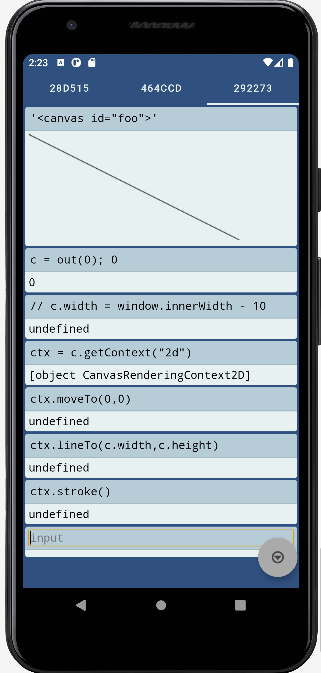

# JSlabs

A simple android app for evaluating JavaScript code in a 
browser context.

# Description

The author was in need of a more capable calculator app than what's included with Android. After finding none that pleased him he made one himself. Javascript is turing complete, WebViews provide javascript and the eval() function. Thusly JSlab was created.

# Screenshot

